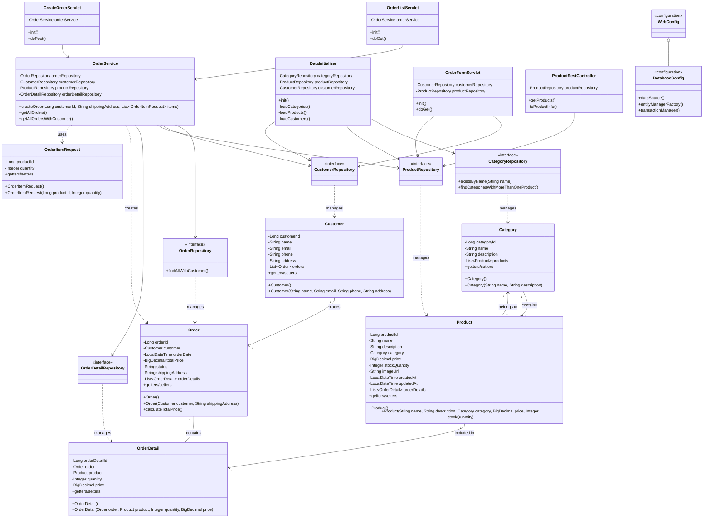

## Отчет о лаботаротоной работе №5. Разработка и развертывание Web-приложений

#### Ход работы

#### Задание 1-4.

Скопировал результат лаб. работы №4 в less10/lab.
Скачал и установил Apache Tomcat 11.
Добавил пользователя с правами администратора.
```xml
<?xml version="1.0" encoding="UTF-8"?>
<!-- tomcat-users.xml -->
<tomcat-users xmlns="http://tomcat.apache.org/xml"
              xmlns:xsi="http://www.w3.org/2001/XMLSchema-instance"
              xsi:schemaLocation="http://tomcat.apache.org/xml tomcat-users.xsd"
              version="1.0">
    <role rolename="manager-gui"/>
    <role rolename="admin-gui"/>
    <user username="admin" password="admin" roles="manager-gui,admin-gui"/>
</tomcat-users>
```

Настроил проект так, чтобы результат сборки формировался в war файл
```kotlin
plugins {
    id("java")
    id("war")
    id("application")
}
tasks.withType<War> {
    archiveFileName.set("app.war")
    duplicatesStrategy = DuplicatesStrategy.EXCLUDE
    from(configurations.runtimeClasspath) {
        into("WEB-INF/lib")
    }
}
```
Скопировал папку product-table из директории /les06 в /less08. Удалил ненужные классы.
Установил нужные зависимости (H2, HikariCP).

#### Задание 5. Реализуйте Java-сервлет формирующий Web-страницу с информацией о заказах. Страница должна содержать кнопку для перехода на форму создания заказа.

```java
package ru.bsuedu.cad.lab.servlet;

import jakarta.servlet.ServletException;
import jakarta.servlet.http.HttpServlet;
import jakarta.servlet.http.HttpServletRequest;
import jakarta.servlet.http.HttpServletResponse;
import org.springframework.web.context.support.WebApplicationContextUtils;
import ru.bsuedu.cad.lab.entity.Order;
import ru.bsuedu.cad.lab.service.OrderService;

import java.io.IOException;
import java.io.PrintWriter;

public class OrderListServlet extends HttpServlet {

    private OrderService orderService;

    @Override
    public void init() throws ServletException {
        var context = WebApplicationContextUtils.getRequiredWebApplicationContext(getServletContext());
        orderService = context.getBean(OrderService.class);
    }

    @Override
    protected void doGet(HttpServletRequest req, HttpServletResponse resp)
            throws ServletException, IOException {

        resp.setContentType("text/html;charset=UTF-8");
        resp.setCharacterEncoding("UTF-8");
        req.setCharacterEncoding("UTF-8");
        PrintWriter out = resp.getWriter();

        out.println("<!DOCTYPE html>");
        out.println("<html>");
        out.println("<head><title>Order List</title>");
        out.println("<style>");
        out.println("table { border-collapse: collapse; width: 80%; margin: 20px auto; }");
        out.println("th, td { border: 1px solid #ddd; padding: 8px; text-align: left; }");
        out.println("th { background-color: #4CAF50; color: white; }");
        out.println("button { padding: 10px; background-color: #008CBA; color: white; ");
        out.println("        border: none; border-radius: 4px; cursor: pointer; }");
        out.println("</style>");
        out.println("</head>");
        out.println("<body>");

        out.println("<h1 style='text-align:center;'>Order List</h1>");

        out.println("<div style='text-align:center; margin:20px;'>");
        out.println("<button onclick=\"window.location.href='/app/order-form'\">");
        out.println("➕ Create New Order");
        out.println("</button>");
        out.println("</div>");

        // Orders table
        out.println("<table>");
        out.println("<thead>");
        out.println("<tr><th>Order ID</th><th>Customer</th><th>Date</th><th>Total</th><th>Status</th><th>Address</th></tr>");
        out.println("</thead>");
        out.println("<tbody>");

        for (Order order : orderService.getAllOrdersWithCustomer()) {
            out.println("<tr>");
            out.println("<td>" + order.getOrderId() + "</td>");
            out.println("<td>" + order.getCustomer().getName() + "</td>");
            out.println("<td>" + order.getOrderDate() + "</td>");
            out.println("<td>" + order.getTotalPrice() + " RUB</td>");
            out.println("<td>" + order.getStatus() + "</td>");
            out.println("<td>" + order.getShippingAddress() + "</td>");
            out.println("</tr>");
        }

        out.println("</tbody>");
        out.println("</table>");

        out.println("</body>");
        out.println("</html>");
    }
}
```
#### Задание 6. Реализуйте Java-сервлет формирующий Web-страницу с формой для создания заказа. После создания заказа должен открываться список заказов.

```java
package ru.bsuedu.cad.lab.servlet;

public class OrderFormServlet extends HttpServlet {

    private CustomerRepository customerRepository;
    private ProductRepository productRepository;

    @Override
    public void init() throws ServletException {
        var context = WebApplicationContextUtils.getRequiredWebApplicationContext(getServletContext());
        customerRepository = context.getBean(CustomerRepository.class);
        productRepository = context.getBean(ProductRepository.class);
    }

    @Override
    protected void doGet(HttpServletRequest req, HttpServletResponse resp)
            throws ServletException, IOException {
        resp.setContentType("text/html;charset=UTF-8");
        resp.setCharacterEncoding("UTF-8");
        req.setCharacterEncoding("UTF-8");
        PrintWriter out = resp.getWriter();

        out.println("<!DOCTYPE html>");
        out.println("<html>");
        out.println("<head><title>Create Order</title>");
        out.println("<style>");
        out.println("form { width: 50%; margin: 20px auto; padding: 20px; border: 1px solid #ccc; border-radius: 8px; }");
        out.println("label { display: block; margin-top: 10px; }");
        out.println("select, input { width: 100%; padding: 8px; margin-top: 5px; }");
        out.println("button { margin-top: 20px; padding: 10px; background-color: #4CAF50; color: white; border: none; border-radius: 4px; cursor: pointer; }");
        out.println(".product-row { margin: 10px 0; padding: 10px; border: 1px solid #eee; }");
        out.println("</style>");
        out.println("<script>");
        out.println("let productIndex = 0;");
        out.println("function addProduct() {");
        out.println("  const container = document.getElementById('products-container');");
        out.println("  const div = document.createElement('div');");
        out.println("  div.className = 'product-row';");
        out.println("  div.innerHTML = `");
        out.println("    <select name='productId' required>");
        out.println("      <option value=''>Select product</option>");

        for (Product product : productRepository.findAll()) {
            out.println("      <option value='" + product.getProductId() + "'>"
                    + product.getName() + " - " + product.getPrice() + " RUB</option>");
        }

        out.println("    </select>");
        out.println("    <input type='number' name='quantity' placeholder='Quantity' min='1' required>");
        out.println("    <button type='button' onclick='this.parentElement.remove()'>Remove</button>`;");
        out.println("  container.appendChild(div);");
        out.println("}");
        out.println("</script>");
        out.println("</head>");
        out.println("<body>");

        out.println("<h1 style='text-align:center;'>Create New Order</h1>");

        out.println("<form action='/app/create-order' method='POST'>");

        // Customer selection
        out.println("<label>Customer:</label>");
        out.println("<select name='customerId' required>");
        out.println("<option value=''>Select customer</option>");
        for (Customer customer : customerRepository.findAll()) {
            out.println("<option value='" + customer.getCustomerId() + "'>"
                    + customer.getName() + " - " + customer.getEmail() + "</option>");
        }
        out.println("</select>");

        out.println("<label>Shipping address:</label>");
        out.println("<input type='text' name='shippingAddress' required>");

        out.println("<label>Products:</label>");
        out.println("<div id='products-container'>");
        out.println("<div class='product-row'>");
        out.println("<select name='productId' required>");
        out.println("<option value=''>Select product</option>");
        for (Product product : productRepository.findAll()) {
            out.println("<option value='" + product.getProductId() + "'>"
                    + product.getName() + " - " + product.getPrice() + " RUB</option>");
        }
        out.println("</select>");
        out.println("<input type='number' name='quantity' placeholder='Quantity' min='1' required>");
        out.println("<button type='button' onclick='this.parentElement.remove()'>Remove</button>");
        out.println("</div>");
        out.println("</div>");

        out.println("<button type='button' onclick='addProduct()'>➕ Add product</button>");
        out.println("<button type='submit'>✅ Create order</button>");

        out.println("</form>");

        out.println("<div style='text-align:center; margin-top:20px;'>");
        out.println("<button onclick=\"window.location.href='/app/orders'\">← Back to orders</button>");
        out.println("</div>");

        out.println("</body>");
        out.println("</html>");
    }
}

```

#### Задание 7. Реализуйте Java-сервлет представляющий REST сервис для получения информации о продуктах. Для каждого продукта необходимо вывести следующую информацию: Название продукта, название категории, количество на складе.

```java
package ru.bsuedu.cad.lab.rest;

@RestController
@RequestMapping("/api/products")
public class ProductRestController {

    private final ProductRepository productRepository;

    public ProductRestController(ProductRepository productRepository) {
        this.productRepository = productRepository;
    }

    @GetMapping
    public List<Map<String, Object>> getProducts() {
        return productRepository.findAll().stream()
                .map(this::toProductInfo)
                .collect(Collectors.toList());
    }

    private Map<String, Object> toProductInfo(Product product) {
        Map<String, Object> info = new HashMap<>();
        info.put("productName", product.getName());
        info.put("categoryName", product.getCategory() != null ? product.getCategory().getName() : "Без категории");
        info.put("stockQuantity", product.getStockQuantity());
        return info;
    }
}
```
UML диаграмма

## Выводы
 Получил базовое понимание в разработке и развертывании Web-приложений.