# Лабораторная работа 7. Spring Security. Basic Authentication

## Выполненные задания

1. Скопирован результат лабораторной работы №6 в директорию `/les14/lab/`
2. Добавлены зависимости `spring-security-web` и `spring-security-config`
3. Реализована конфигурация безопасности `SecurityConfig` с двумя `SecurityFilterChain`:
   - для REST API (`/api/**`) — HTTP Basic Authentication
   - для веб-интерфейса — Form Login
4. Созданы пользователи в памяти (`InMemoryUserDetailsManager`):
   - `user` / `password` — роль `USER` (только просмотр)
   - `manager` / `password` — роль `MANAGER` (все операции)
5. Реализован `LoginController` с маршрутами `/login` и перенаправлением с `/`
6. Создана страница входа на Thymeleaf с отображением ошибок и подсказками
7. Добавлен `SecurityInitializer`, расширяющий `AbstractSecurityWebApplicationInitializer`
8. `AppInitializer` обновлён — `SecurityConfig` добавлен в root-контекст
9. Приложение собрано командой `gradle war` и задеплоено на Apache Tomcat 11

## Описание реализации

Безопасность построена на двух независимых `SecurityFilterChain`:

- **REST API** (`/api/**`) — защищён HTTP Basic Authentication; CSRF отключён для API-клиентов
- **Веб-интерфейс** — форм-based аутентификация; страница входа `/login`; выход `/logout`

Разграничение прав:
- `USER` — только GET-запросы
- `MANAGER` — полный доступ (создание, изменение, удаление)

## Пользователи

| Логин   | Пароль   | Роль    | Доступ                                |
|---------|----------|---------|---------------------------------------|
| user    | password | USER    | Только просмотр заказов              |
| manager | password | MANAGER | Все операции с заказами               |

## Доступ к ресурсам

### Веб-интерфейс (Form Login)

| URL                   | Метод     | Роли           |
|-----------------------|-----------|----------------|
| `/login`              | GET       | Все            |
| `/orders`             | GET       | USER, MANAGER  |
| `/orders/new`         | GET       | MANAGER        |
| `/orders`             | POST      | MANAGER        |
| `/orders/{id}/edit`   | GET       | MANAGER        |
| `/orders/{id}`        | POST      | MANAGER        |
| `/orders/{id}/delete` | POST      | MANAGER        |

### REST API (Basic Auth)

| URL                    | Метод  | Роли           |
|------------------------|--------|----------------|
| `/api/orders`          | GET    | USER, MANAGER  |
| `/api/orders/{id}`     | GET    | USER, MANAGER  |
| `/api/orders`          | POST   | MANAGER        |
| `/api/orders/{id}`     | PUT    | MANAGER        |
| `/api/orders/{id}`     | DELETE | MANAGER        |

### Примеры Basic Auth для REST:

```bash
# Просмотр заказов (user)
curl -u user:password http://localhost:8080/app/api/orders

# Создание заказа (manager)
curl -u manager:password -X POST \
  -H "Content-Type: application/json" \
  -d '{"customerId":1,"shippingAddress":"Москва, ул. Ленина, 1","items":[{"productId":1,"quantity":2}]}' \
  http://localhost:8080/app/api/orders

# Удаление заказа (manager)
curl -u manager:password -X DELETE http://localhost:8080/app/api/orders/1
```

## Сборка и запуск

```bash
# Сборка WAR-файла
gradle war

# Деплой на Tomcat
cp build/libs/app.war /opt/homebrew/Cellar/tomcat/11.0.21/libexec/webapps/

# Приложение доступно по адресу:
# http://localhost:8080/app/orders
# Страница входа: http://localhost:8080/app/login
```

## UML-диаграмма классов

```mermaid
classDiagram
    class SecurityConfig {
        +apiSecurityFilterChain(HttpSecurity) SecurityFilterChain
        +webSecurityFilterChain(HttpSecurity) SecurityFilterChain
        +userDetailsService() UserDetailsService
    }

    class SecurityInitializer {
    }

    class AppInitializer {
        +getRootConfigClasses() Class[]
        +getServletConfigClasses() Class[]
        +getServletMappings() String[]
    }

    class DatabaseConfig {
        +dataSource() DataSource
        +entityManagerFactory(DataSource) LocalContainerEntityManagerFactoryBean
        +transactionManager(EntityManagerFactory) PlatformTransactionManager
    }

    class WebConfig {
        +templateResolver() ClassLoaderTemplateResolver
        +templateEngine() SpringTemplateEngine
        +viewResolver() ViewResolver
    }

    class LoginController {
        +loginPage() String
        +home() String
    }

    class OrderController {
        +listOrders(Model) String
        +showCreateForm(Model) String
        +createOrder(...) String
        +showEditForm(id, Model) String
        +updateOrder(...) String
        +deleteOrder(id) String
    }

    class OrderRestController {
        +getAllOrders() List~OrderResponse~
        +getOrderById(id) ResponseEntity~OrderResponse~
        +createOrder(request) ResponseEntity~OrderResponse~
        +updateOrder(id, request) ResponseEntity~OrderResponse~
        +deleteOrder(id) ResponseEntity~Void~
    }

    class OrderService {
        +createOrder(customerId, shippingAddress, items) Order
        +getAllOrders() List~Order~
        +getOrderById(id) Order
        +updateOrder(id, status, shippingAddress) Order
        +deleteOrder(id) void
        +getAllCustomers() List~Customer~
        +getAllProducts() List~Product~
    }

    class Category {
        -Long categoryId
        -String name
        -String description
    }

    class Product {
        -Long productId
        -String name
        -String description
        -BigDecimal price
        -Integer stockQuantity
    }

    class Customer {
        -Long customerId
        -String name
        -String email
        -String phone
        -String address
    }

    class Order {
        -Long orderId
        -LocalDateTime orderDate
        -BigDecimal totalPrice
        -String status
        -String shippingAddress
    }

    class OrderDetail {
        -Long orderDetailId
        -Integer quantity
        -BigDecimal price
    }

    AppInitializer --> DatabaseConfig
    AppInitializer --> SecurityConfig
    AppInitializer --> WebConfig
    SecurityConfig ..> UserDetailsService : создаёт
    Category "1" --> "0..*" Product : содержит
    Customer "1" --> "0..*" Order : оформляет
    Order "1" --> "1..*" OrderDetail : включает
    Product "1" --> "0..*" OrderDetail : входит в
    OrderController --> OrderService
    OrderRestController --> OrderService
    LoginController ..> SecurityConfig : использует
```


