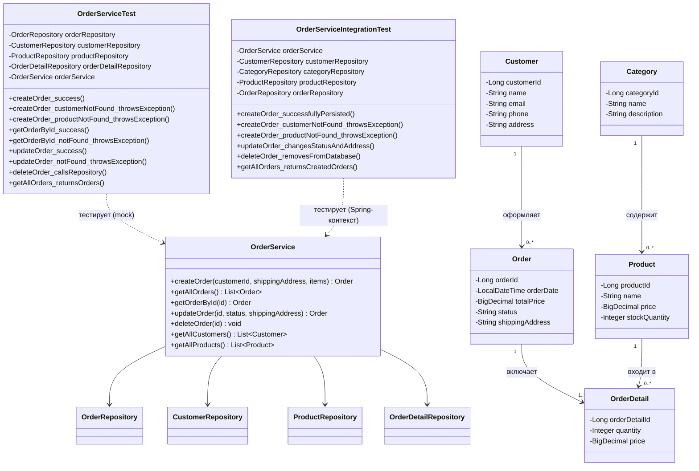

# Лабораторная работа 8. Основы тестирования

## Выполненные задания

1. Скопирован результат лабораторной работы №7 в директорию `/les16/lab/`
2. Добавлены зависимости для тестирования: `junit-jupiter`, `mockito-core`, `mockito-junit-jupiter`, `spring-test`, `assertj-core`
3. Добавлен плагин `jacoco` и настроен `jacocoTestReport` для генерации HTML-отчёта
4. Реализованы unit-тесты `OrderServiceTest` с использованием Mockito: 9 тестов для бизнес-логики `OrderService` в изоляции от базы данных
5. Реализованы интеграционные тесты `OrderServiceIntegrationTest` с реальным Spring-контекстом и H2-базой данных: 6 тестов
6. Все 15 тестов проходят успешно
7. Сформирован HTML-отчёт JaCoCo о покрытии кода

## Описание реализации

Тестирование организовано на двух уровнях:

- **Unit-тесты** (`OrderServiceTest`) — тестируют бизнес-логику `OrderService` в изоляции: все зависимости (репозитории) заменены моками Mockito. Позволяют быстро проверять логику без запуска Spring-контекста.
- **Интеграционные тесты** (`OrderServiceIntegrationTest`) — запускают реальный Spring-контекст (`DatabaseConfig`) с H2 in-memory БД, проверяют корректность взаимодействия сервиса с JPA-репозиториями.

JaCoCo автоматически запускается после `gradle test` и формирует HTML-отчёт в `build/jacocoHtml/`.

## Unit-тесты (OrderServiceTest)

| Тест | Описание |
|------|----------|
| `createOrder_success` | Успешное создание заказа |
| `createOrder_customerNotFound_throwsException` | Исключение при отсутствии клиента |
| `createOrder_productNotFound_throwsException` | Исключение при отсутствии товара |
| `getOrderById_success` | Успешное получение заказа по ID |
| `getOrderById_notFound_throwsException` | Исключение при отсутствии заказа |
| `updateOrder_success` | Успешное обновление статуса и адреса |
| `updateOrder_notFound_throwsException` | Исключение при отсутствии заказа |
| `deleteOrder_callsRepository` | Проверка вызова репозитория при удалении |
| `getAllOrders_returnsOrders` | Возврат всех заказов |

## Интеграционные тесты (OrderServiceIntegrationTest)

| Тест | Описание |
|------|----------|
| `createOrder_successfullyPersisted` | Заказ сохраняется и считывается из БД |
| `createOrder_customerNotFound_throwsException` | Несуществующий клиент |
| `createOrder_productNotFound_throwsException` | Несуществующий товар |
| `updateOrder_changesStatusAndAddress` | Изменение статуса и адреса |
| `deleteOrder_removesFromDatabase` | Удаление из БД |
| `getAllOrders_returnsCreatedOrders` | Возврат всех созданных заказов |

## Запуск тестов

```bash
# Запустить все тесты и сформировать отчёт JaCoCo
gradle test

```

## UML-диаграмма классов


